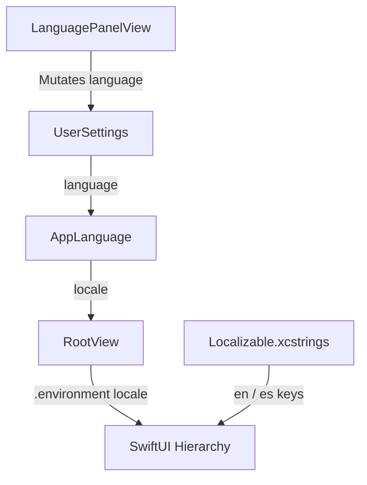

# Design: App Localization

## Architecture & Data Flow

## Localization Strategy

1. **String Catalog (`Localizable.xcstrings`)**:
   - Single source of truth for app text in `en` and `es`.
   - Automatic key extraction for `Text("...")` in SwiftUI.
   - Explicit keys for dynamic string interpolations and enum display names.

2. **Locale Propagation**:
   - `RootView` subscribes to `@Environment(UserSettings.self)`.
   - Applies `.environment(\.locale, userSettings.language.locale)` at the root container level.

3. **Key Naming Convention**:
   - Navigation: `nav.studio`, `nav.convert`, `nav.settings`
   - Actions: `action.browse`, `action.clear_all`, `action.dismiss`
   - Statuses & Headers: `header.convert_title`, `header.convert_subtitle`, etc.

## Affected Files

1. `Localizable.xcstrings`: String Catalog resource file.
2. `App/RootView.swift`: Subscribes to `UserSettings` and applies `.environment(\.locale, ...)`.
3. `Scenes/*`: `DashboardScene.swift`, `ConvertScene.swift`, `SettingsScene.swift`.
4. `Features/Conversions/Views/*`: `TopNavHeaderView.swift`, `ConvertHeadingView.swift`, `BatchDropzoneView.swift`, `BatchQueueView.swift`, `BatchQueueItemRow.swift`, `ImportRejectionListView.swift`, `SquooshInspectorView.swift`, `OutputSettingsView.swift`, `TelemetryFooterView.swift`, `StatusFooterView.swift`, `ConversionsTableView.swift`, `ConversionDetailModalView.swift`, `MetricsHeaderView.swift`.
5. `Features/Settings/Views/*`: `SettingsHeadingView.swift`, `SettingsSidebarView.swift`, `AppearancePanelView.swift`, `LanguagePanelView.swift`, `WorkflowPanelView.swift`.
6. `Monarch-conversionsTests/AppLocalizationTests.swift`: Unit tests for string catalog key resolution.
