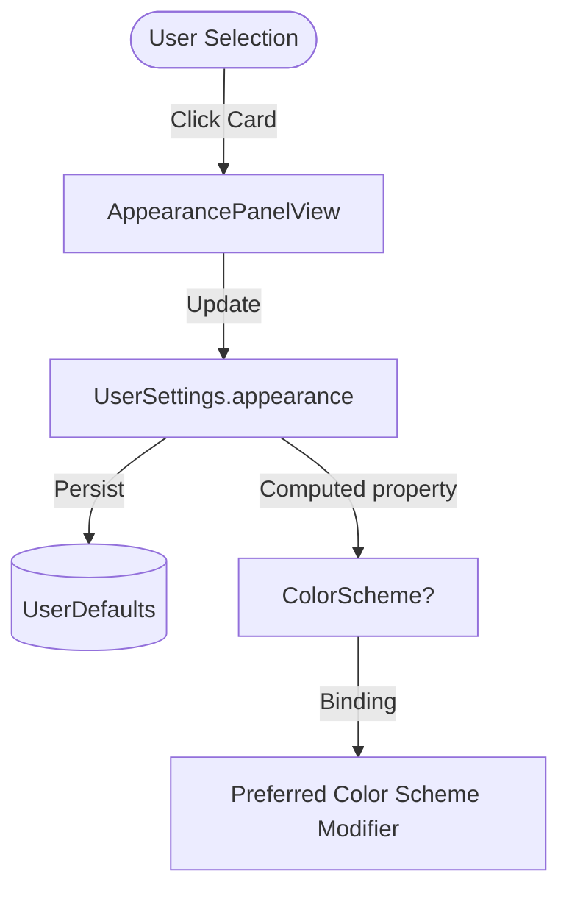

# Technical Design: Appearance Preference

## Component Changes

### 1. `UserSettings.swift`
- Annotate `appearance` property with `@AppStorage` / custom `UserDefaults` backing in `@Observable` `UserSettings`.
- Provide helper mapping `appearance` (`AppearanceOption`) to `SwiftUI.ColorScheme?`:
  - `.dark` -> `.dark`
  - `.light` -> `.light`
  - `.system` -> `nil` (inherits OS color scheme).

### 2. Root View / Application Scene
- Apply `.preferredColorScheme(userSettings.colorScheme)` at the root view level.

### 3. `AppearancePanelView.swift`
- Ensure cards for Dark, Light, and System update `settings.appearance`.
- Add `.accessibilityElement(children: .combine)`, `.accessibilityLabel(...)`, and `.accessibilityAddTraits(.isSelected)` forVoiceOver support.

## Data Flow Diagram

