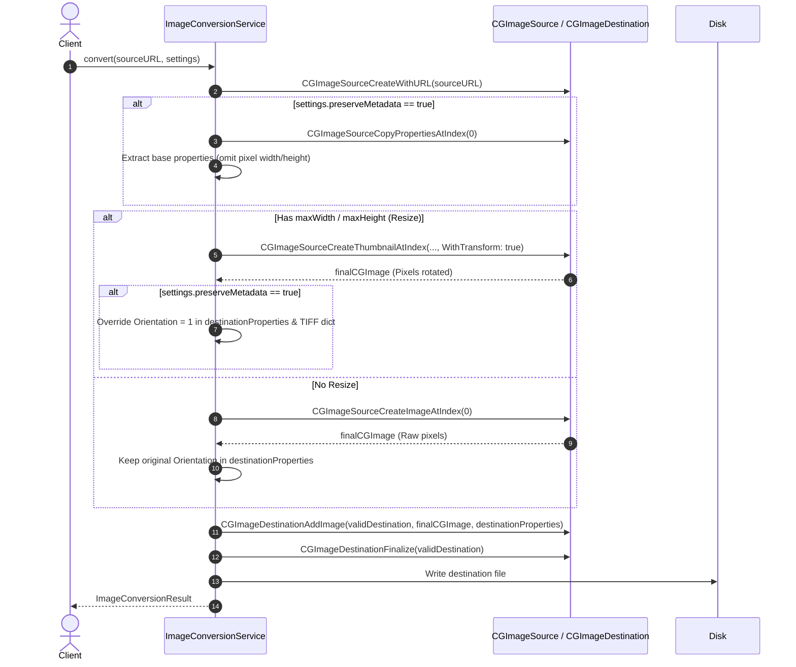

# Design: Orientation and Metadata Synchronization

## Architectural Decisions

### Decision 1: Post-Decode Metadata Adjustment
When `settings.preserveMetadata` is `true`, source properties are extracted via `CGImageSourceCopyPropertiesAtIndex`.
However, because the decoded `CGImage` may or may not undergo a physical pixel transformation depending on whether `CGImageSourceCreateThumbnailAtIndex(..., kCGImageSourceCreateThumbnailWithTransform: true)` is executed:
- If resized with transform: the orientation in the metadata dictionary must be overwritten to `1` (normal / top-left) for both `kCGImagePropertyOrientation` and inside any `{TIFF}` sub-dictionary (`kCGImagePropertyTIFFOrientation`).
- If not resized: `CGImageSourceCreateImageAtIndex` returns the untransformed pixels, so preserving the original `Orientation` tag is correct.

### Decision 2: Sanitizing Thumbnail Dictionaries
When copying properties, embedded thumbnail representations (such as `{MakerApple}` preview offsets, thumbnail dictionaries) could cause viewers to show an outdated thumbnail. We strip thumbnail-specific properties from `destinationProperties` prior to encoding.

## Sequence Diagram

