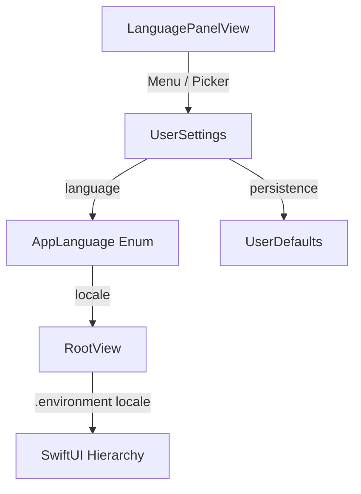

# Design: Language Preference Setting

## Architecture & Data Flow



## Types & Data Structures

### `AppLanguage` Enum
```swift
enum AppLanguage: String, CaseIterable, Identifiable, Codable {
    case english = "en"
    case spanish = "es"
    
    var id: String { rawValue }
    
    var displayName: String {
        switch self {
        case .english: return "English (United States)"
        case .spanish: return "Español"
        }
    }
    
    var locale: Locale {
        Locale(identifier: rawValue)
    }
}
```

## Affected Files
1. `UserSettings.swift`: Add `AppLanguage` enum and persisted `language` property.
2. `LanguagePanelView.swift`: Add interactive `Menu` or `Picker` for language selection with VoiceOver accessibility.
3. `RootView.swift`: Apply `.environment(\.locale, userSettings.language.locale)`.
4. `UserSettingsTests.swift`: Add unit tests for default language, persistence, and locale generation.
