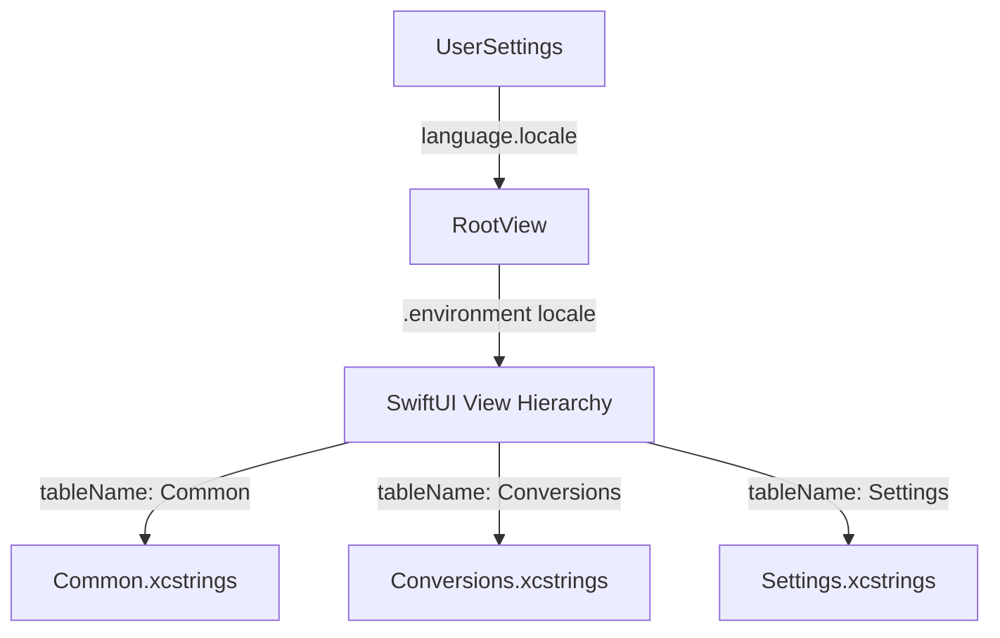

# Design: Split String Catalogs by Domain

## Architecture & Data Flow

## Domain Partitioning

1. **`Common.xcstrings`** (`tableName: "Common"`):
   - Navigation: `nav.studio`, `nav.convert`, `nav.settings`, `badge.conversions`, `badge.settings`
   - Common Actions: `action.browse`, `action.clear_all`, `action.dismiss`
   - Global Search: `search.placeholder`
   - Footers: `footer.throughput`, `footer.avg_latency`, `footer.export_telemetry`, `footer.synced`, `footer.quality %@`

2. **`Conversions.xcstrings`** (`tableName: "Conversions"`):
   - Convert Scene: `header.convert_title`, `header.convert_subtitle`, `convert.supported_formats`
   - Dropzone & Queue: `dropzone.title`, `dropzone.subtitle`, `dropzone.limit`, `queue.title %lld`, `rejection.title %lld`
   - Inspector & Output: `inspector.comparison`, `inspector.mode`, `inspector.zoom`, `output.title`, `output.preset`, `output.format`, `output.quality`, `output.dimensions`, `output.metadata`, `output.estimated_savings`, `output.add_batch`
   - Dashboard & Table: `metrics.processed`, `metrics.in_queue`, `metrics.converted_today`, `metrics.storage_saved`, `metrics.active_projects`, `table.active_conversions`, `table.filter_*`, `table.col_*`, `status.working`, `status.done`
   - Modal: `modal.*`

3. **`Settings.xcstrings`** (`tableName: "Settings"`):
   - Settings Scene: `settings.personal_preferences`, `settings.heading_subtitle`, `settings.group_general`, `settings.group_workspace`, `settings.section_*`
   - Appearance: `appearance.*`
   - Language: `language.*`
   - Workflow: `workflow.*`

## Affected Files
1. Create `Monarch-conversions/Common.xcstrings`
2. Create `Monarch-conversions/Conversions.xcstrings`
3. Create `Monarch-conversions/Settings.xcstrings`
4. Delete `Monarch-conversions/Localizable.xcstrings`
5. Update Views in `App/`, `Scenes/`, `Features/Conversions/Views/`, `Features/Settings/Views/` with `tableName`.
6. Update `Monarch-conversionsTests/AppLocalizationTests.swift`.
